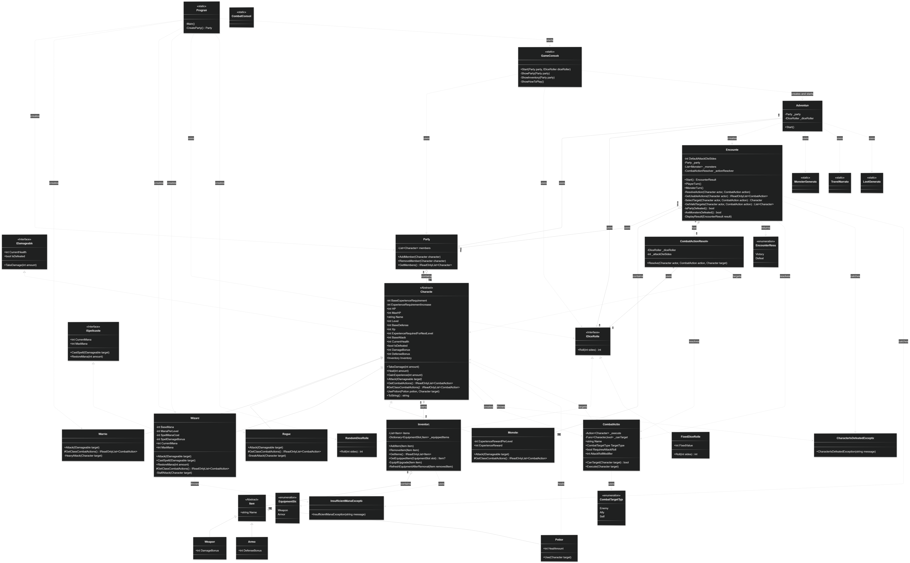

# DnD Console Game

A console-based Dungeons & Dragons inspired adventure game developed in C#.

## UML Diagram

The UML diagram shows the structure of the DnD application, including classes, inheritance, interfaces, relationships and cardinalities.

For the complete UML source, see [UML.md](docs/UML.md).
