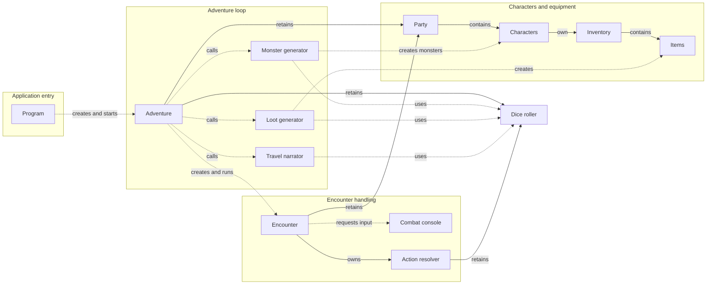

# Readable UML Guide

This page gives a high-level view of the application. The detailed diagrams
below each cover one connected part of the system, while the
[Everything diagram](UML.md) keeps the complete model in one place.

> **Canonical diagram:** [UML.md](UML.md) is the authoritative version. These
> smaller views are maintained for readability and may occasionally lag behind
> it. If the diagrams disagree, follow `UML.md`.

## Focused diagrams

- [Characters and combat actions](diagrams/Characters-and-Actions.md) - inheritance, health, mana, and available actions
- [Party, inventory, and items](diagrams/Party-and-Items.md) - ownership, equipment, weapons, armor, and potions
- [Encounter handling](diagrams/Encounter.md) - turn selection, target selection, action resolution, and encounter results
- [Adventure and supporting services](diagrams/Adventure-and-Services.md) - the game loop, generation, rewards, travel, and dice implementations
