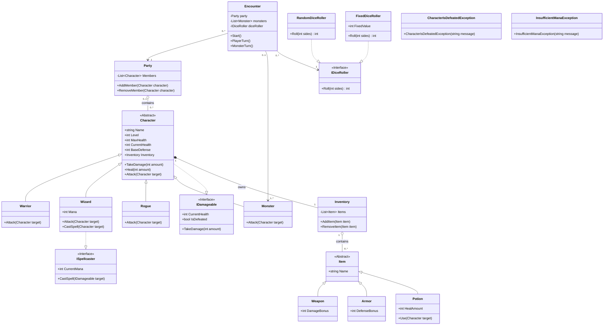

# UML Class Diagram

Character and Inventory use composition because the Inventory belongs to the
Character and does not exist independently. Inventory and Item use aggregation
because Items can exist independently and can be transferred between
inventories.
