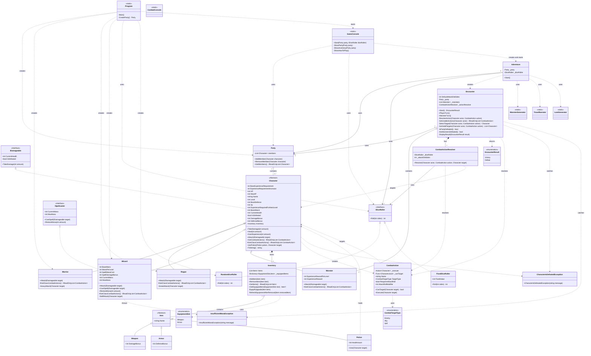

# UML Diagram

```mermaid
classDiagram

class Program {
    <<static>>
    -Main()
    -CreateParty() Party
}

class GameConsole {
    <<static>>
    +Start(Party party, IDiceRoller diceRoller)
    -ShowParty(Party party)
    -ShowInventory(Party party)
    -ShowHowToPlay()
}

class Character {
    <<Abstract>>
    -int BaseExperienceRequirement
    -int ExperienceRequirementIncrease
    +int HP
    +int MaxHP
    +string Name
    +int Level
    +int BaseDefense
    +int Xp
    +int ExperienceRequiredForNextLevel
    +int BaseAttack
    +int CurrentHealth
    +bool IsDefeated
    +int DamageBonus
    +int DefenseBonus
    +Inventory Inventory
    +TakeDamage(int amount)
    +Heal(int amount)
    +GainExperience(int amount)
    +Attack(IDamageable target)*
    +GetCombatActions() IReadOnlyList~CombatAction~
    #GetClassCombatActions() IReadOnlyList~CombatAction~*
    -UsePotion(Potion potion, Character target)
    +ToString() string
}

class Warrior {
    +Attack(IDamageable target)
    #GetClassCombatActions() IReadOnlyList~CombatAction~
    -HeavyAttack(Character target)
}

class Wizard {
    -int BaseMana
    -int ManaPerLevel
    -int SpellManaCost
    -int SpellDamageBonus
    +int CurrentMana
    +int MaxMana
    +Attack(IDamageable target)
    +CastSpell(IDamageable target)
    +RestoreMana(int amount)
    #GetClassCombatActions() IReadOnlyList~CombatAction~
    -StaffAttack(Character target)
}

class Rogue {
    +Attack(IDamageable target)
    #GetClassCombatActions() IReadOnlyList~CombatAction~
    -SneakAttack(Character target)
}

class Monster {
    -int ExperienceRewardPerLevel
    +int ExperienceReward
    +Attack(IDamageable target)
    #GetClassCombatActions() IReadOnlyList~CombatAction~
}

class IDamageable {
    <<Interface>>
    +int CurrentHealth
    +bool IsDefeated
    +TakeDamage(int amount)
}

class ISpellcaster {
    <<Interface>>
    +int CurrentMana
    +int MaxMana
    +CastSpell(IDamageable target)
    +RestoreMana(int amount)
}

class IDiceRoller {
    <<Interface>>
    +Roll(int sides) int
}

class RandomDiceRoller {
    +Roll(int sides) int
}

class FixedDiceRoller {
    +int FixedValue
    +Roll(int sides) int
}

class CombatAction {
    -Action~Character~ _execute
    -Func~Character,bool~ _canTarget
    +string Name
    +CombatTargetType TargetType
    +bool RequiresAttackRoll
    +int AttackRollModifier
    +CanTarget(Character target) bool
    +Execute(Character target)
}

class CombatTargetType {
    <<enumeration>>
    Enemy
    Ally
    Self
}

class Party {
    -List~Character~ members
    +AddMember(Character character)
    +RemoveMember(Character character)
    +GetMembers() IReadOnlyList~Character~
}

class Inventory {
    -List~Item~ items
    -Dictionary~EquipmentSlot,Item~ _equippedItems
    +AddItem(Item item)
    +RemoveItem(Item item)
    +GetItems() IReadOnlyList~Item~
    +GetEquippedItem(EquipmentSlot slot) Item?
    -EquipIfUpgrade(Item item)
    -RefreshEquipmentAfterRemoval(Item removedItem)
}

class EquipmentSlot {
    <<enumeration>>
    Weapon
    Armor
}

class Item {
    <<Abstract>>
    +string Name
}

class Weapon {
    +int DamageBonus
}

class Armor {
    +int DefenseBonus
}

class Potion {
    +int HealAmount
    +Use(Character target)
}

class Encounter {
    -int DefaultAttackDieSides
    -Party _party
    -List~Monster~ _monsters
    -CombatActionResolver _actionResolver
    +Start() EncounterResult
    +PlayerTurn()
    +MonsterTurn()
    -ResolveAction(Character actor, CombatAction action)
    -GetUsableActions(Character actor) IReadOnlyList~CombatAction~
    -SelectTarget(Character actor, CombatAction action) Character
    -GetValidTargets(Character actor, CombatAction action) List~Character~
    -IsPartyDefeated() bool
    -AreMonstersDefeated() bool
    -DisplayResult(EncounterResult result)
}

class EncounterResult {
    <<enumeration>>
    Victory
    Defeat
}

class CombatActionResolver {
    -IDiceRoller _diceRoller
    -int _attackDieSides
    +Resolve(Character actor, CombatAction action, Character target)
}

class CombatConsole {
    <<static>>
}

class Adventure {
    -Party _party
    -IDiceRoller _diceRoller
    +Start()
}

class MonsterGenerator {
    <<static>>
}

class TravelNarrator {
    <<static>>
}

class LootGenerator {
    <<static>>
}

class CharacterIsDefeatedException {
    +CharacterIsDefeatedException(string message)
}

class InsufficientManaException {
    +InsufficientManaException(string message)
}


%% =========================
%% INHERITANCE
%% =========================

Character <|-- Warrior
Character <|-- Rogue
Character <|-- Wizard
Character <|-- Monster

Item <|-- Weapon
Item <|-- Armor
Item <|-- Potion


%% =========================
%% INTERFACES
%% =========================

IDamageable <|.. Character
ISpellcaster <|.. Wizard

IDiceRoller <|.. RandomDiceRoller
IDiceRoller <|.. FixedDiceRoller


%% =========================
%% PARTY / INVENTORY
%% =========================

Party "1" o-- "0..*" Character : contains
Character "1" *-- "1" Inventory : owns
Inventory "1" o-- "0..*" Item : contains
Inventory ..> EquipmentSlot : uses
Potion ..> Character : heals


%% =========================
%% COMBAT ACTIONS
%% =========================

Character ..> CombatAction : creates
CombatAction ..> Character : targets
CombatAction ..> CombatTargetType : uses


%% =========================
%% ENCOUNTER / COMBAT
%% =========================

Encounter "1" --> "1" Party : uses
Encounter "1" o-- "1..*" Monster : contains
Encounter "1" *-- "1" CombatActionResolver : has

Encounter ..> EncounterResult : returns
Encounter ..> CombatAction : resolves

CombatActionResolver "1" --> "1" IDiceRoller : uses
CombatActionResolver ..> CombatAction : resolves
CombatActionResolver ..> Character : targets


%% =========================
%% GAME FLOW
%% =========================

Program ..> Party : creates
Program ..> Warrior : creates
Program ..> Rogue : creates
Program ..> Wizard : creates
Program ..> IDiceRoller : uses
Program ..> RandomDiceRoller : creates
Program ..> GameConsole : starts

GameConsole ..> Party : uses
GameConsole ..> IDiceRoller : uses
GameConsole ..> Adventure : creates and starts

Adventure "1" --> "1" Party : uses
Adventure "1" --> "1" IDiceRoller : uses
Adventure ..> Encounter : creates
Adventure ..> MonsterGenerator : uses
Adventure ..> TravelNarrator : uses
Adventure ..> LootGenerator : uses


%% =========================
%% EXCEPTIONS
%% =========================

Character ..> CharacterIsDefeatedException : throws
Wizard ..> InsufficientManaException : throws

Encounter ..> CharacterIsDefeatedException : catches
Encounter ..> InsufficientManaException : catches
```