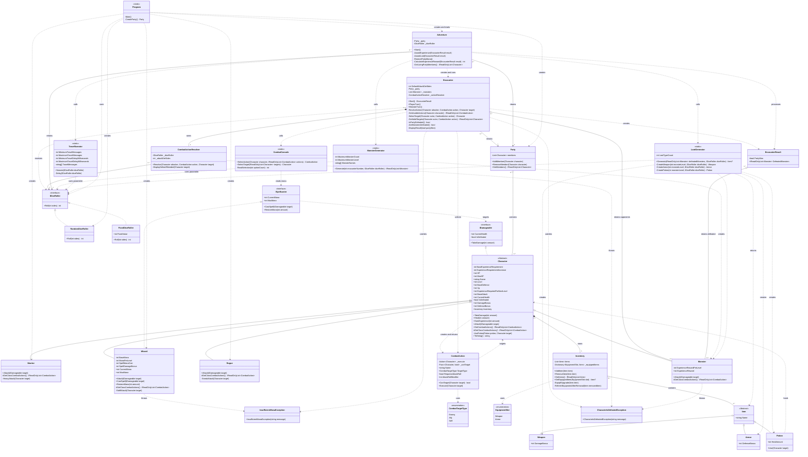

# Everything UML Diagram

This is the complete class diagram. For a less dense entry point, see the
[readable UML guide](UML-Overview.md), which links to smaller connected views.

```mermaid
classDiagram

class Program {
    <<static>>
    -Main()
    -CreateParty() Party
}

class Character {
    <<Abstract>>
    -int BaseExperienceRequirement
    -int ExperienceRequirementIncrease
    +int HP
    +int MaxHP
    +string Name
    +int Level
    +int BaseDefense
    +int Xp
    +int ExperienceRequiredForNextLevel
    +int BaseAttack
    +int CurrentHealth
    +bool IsDefeated
    +int DamageBonus
    +int DefenseBonus
    +Inventory Inventory
    +TakeDamage(int amount)
    +Heal(int amount)
    +GainExperience(int amount)
    +Attack(IDamageable target)*
    +GetCombatActions() IReadOnlyList~CombatAction~
    #GetClassCombatActions() IReadOnlyList~CombatAction~*
    -UsePotion(Potion potion, Character target)
    +ToString() string
}

class Warrior {
    +Attack(IDamageable target)
    #GetClassCombatActions() IReadOnlyList~CombatAction~
    -HeavyAttack(Character target)
}

class Wizard {
    -int BaseMana
    -int ManaPerLevel
    -int SpellManaCost
    -int SpellDamageBonus
    +int CurrentMana
    +int MaxMana
    +Attack(IDamageable target)
    +CastSpell(IDamageable target)
    +RestoreMana(int amount)
    #GetClassCombatActions() IReadOnlyList~CombatAction~
    -StaffAttack(Character target)
}

class Rogue {
    +Attack(IDamageable target)
    #GetClassCombatActions() IReadOnlyList~CombatAction~
    -SneakAttack(Character target)
}

class IDamageable {
    <<Interface>>
    +int CurrentHealth
    +bool IsDefeated
    +TakeDamage(int amount)
}

class ISpellcaster {
    <<Interface>>
    +int CurrentMana
    +int MaxMana
    +CastSpell(IDamageable target)
    +RestoreMana(int amount)
}

class Monster {
    -int ExperienceRewardPerLevel
    +int ExperienceReward
    +Attack(IDamageable target)
    #GetClassCombatActions() IReadOnlyList~CombatAction~
}

Character <|-- Warrior
Character <|-- Wizard
Character <|-- Rogue
Character <|-- Monster

IDamageable <|.. Character
ISpellcaster <|.. Wizard
ISpellcaster ..> IDamageable : targets
Wizard ..> InsufficientManaException : throws

class CombatAction {
    -Action~Character~ _execute
    -Func~Character, bool~ _canTarget
    +string Name
    +CombatTargetType TargetType
    +bool RequiresAttackRoll
    +int AttackRollModifier
    +CanTarget(Character target) bool
    +Execute(Character target)
}

class CombatTargetType {
    <<enumeration>>
    Enemy
    Ally
    Self
}

Character ..> CombatAction : creates and returns
CombatAction ..> Character : targets
CombatAction ..> CombatTargetType : uses

class Party {
    -List~Character~ members
    +AddMember(Character character)
    +RemoveMember(Character character)
    +GetMembers() IReadOnlyList~Character~
}

Party "0..*" o-- "0..*" Character : contains

class Inventory {
    -List~Item~ items
    -Dictionary~EquipmentSlot, Item~ _equippedItems
    +AddItem(Item item)
    +RemoveItem(Item item)
    +GetItems() IReadOnlyList~Item~
    +GetEquippedItem(EquipmentSlot slot) Item?
    -EquipIfUpgrade(Item item)
    -RefreshEquipmentAfterRemoval(Item removedItem)
}

class EquipmentSlot {
    <<enumeration>>
    Weapon
    Armor
}

class Item {
    <<Abstract>>
    +string Name
}

class Weapon {
    +int DamageBonus
}

class Armor {
    +int DefenseBonus
}

class Potion {
    +int HealAmount
    +Use(Character target)
}

Item <|-- Weapon
Item <|-- Armor
Item <|-- Potion

Character "0..1" *-- "1" Inventory : owns
Inventory "0..*" o-- "0..*" Item : contains
Inventory ..> EquipmentSlot : uses
Potion ..> Character : heals

class Encounter {
    -int DefaultAttackDieSides
    -Party _party
    -List~Monster~ _monsters
    -CombatActionResolver _actionResolver
    +Start() EncounterResult
    +PlayerTurn()
    +MonsterTurn()
    -ResolveAction(Character attacker, CombatAction action, Character target)
    -GetUsableActions(Character character) IReadOnlyList~CombatAction~
    -SelectTarget(Character actor, CombatAction action) Character
    -GetValidTargets(Character actor, CombatAction action) IReadOnlyList~Character~
    -IsPartyDefeated() bool
    -AreMonstersDefeated() bool
    -DisplayResult(bool partyWon)
}

Encounter "0..*" --> "1" Party : retains
Encounter "0..*" o-- "1..*" Monster : retains opponents
Encounter "0..1" *-- "1" CombatActionResolver : owns
Encounter ..> EncounterResult : creates
Encounter ..> CombatAction : selects
Encounter ..> IDiceRoller : receives
Encounter ..> CharacterIsDefeatedException : catches
Encounter ..> InsufficientManaException : catches

class EncounterResult {
    +bool PartyWon
    +IReadOnlyList~Monster~ DefeatedMonsters
}

EncounterResult "0..*" o-- "0..*" Monster : retains defeated

class CombatActionResolver {
    -IDiceRoller _diceRoller
    -int _attackDieSides
    +Resolve(Character attacker, CombatAction action, Character target)
    -DisplayDefeatIfNeeded(Character target)
}

class CombatConsole {
    <<static>>
    +SelectAction(Character character, IReadOnlyList~CombatAction~ actions) CombatAction
    +SelectTarget(IReadOnlyList~Character~ targets) Character
    -ReadSelection(int optionCount) int
}

Encounter ..> CombatConsole : calls
CombatConsole ..> ISpellcaster : reads mana
CombatActionResolver "0..*" --> "1" IDiceRoller : retains
CombatActionResolver ..> CharacterIsDefeatedException : throws

class Adventure {
    -Party _party
    -IDiceRoller _diceRoller
    +Start()
    -AwardExperience(EncounterResult result)
    -AwardLoot(EncounterResult result)
    -RestorePartyMana()
    -CalculateExperienceReward(EncounterResult result) int
    -GetLivingPartyMembers() IReadOnlyList~Character~
}

Adventure "0..*" --> "1" Party : retains
Adventure "0..*" --> "1" IDiceRoller : retains
Adventure ..> Encounter : creates and runs
Adventure ..> EncounterResult : processes
Adventure ..> MonsterGenerator : calls
Adventure ..> LootGenerator : calls
Adventure ..> TravelNarrator : calls

class MonsterGenerator {
    <<static>>
    -int MaximumMonsterCount
    -int MaximumMonsterLevel
    -string[] MonsterNames
    +Generate(int encounterNumber, IDiceRoller diceRoller) IReadOnlyList~Monster~
}

class TravelNarrator {
    <<static>>
    -int MinimumTravelMessages
    -int MaximumTravelMessages
    -int MinimumTravelDelayMilliseconds
    -int MaximumTravelDelayMilliseconds
    -string[] TravelMessages
    +Narrate(IDiceRoller diceRoller)
    -Delay(IDiceRoller diceRoller)
}

MonsterGenerator ..> Monster : creates
MonsterGenerator ..> IDiceRoller : uses parameter
TravelNarrator ..> IDiceRoller : uses parameter

class LootGenerator {
    <<static>>
    -int LootTypeCount
    +Generate(IReadOnlyList~Monster~ defeatedMonsters, IDiceRoller diceRoller) Item?
    -CreateWeapon(int monsterLevel, IDiceRoller diceRoller) Weapon
    -CreateArmor(int monsterLevel, IDiceRoller diceRoller) Armor
    -CreatePotion(int monsterLevel, IDiceRoller diceRoller) Potion
}

LootGenerator ..> Monster
LootGenerator ..> Item : returns
LootGenerator ..> Weapon : creates
LootGenerator ..> Armor : creates
LootGenerator ..> Potion : creates
LootGenerator ..> IDiceRoller : uses parameter

class IDiceRoller {
    <<Interface>>
    +Roll(int sides) int
}

class RandomDiceRoller {
    +Roll(int sides) int
}

class FixedDiceRoller {
    +int FixedValue
    +Roll(int sides) int
}

IDiceRoller <|.. RandomDiceRoller
IDiceRoller <|.. FixedDiceRoller

Program ..> Party : creates
Program ..> Warrior : creates
Program ..> Rogue : creates
Program ..> Wizard : creates
Program ..> IDiceRoller : uses
Program ..> RandomDiceRoller : creates
Program ..> Adventure : creates and starts

class CharacterIsDefeatedException {
    +CharacterIsDefeatedException(string message)
}

class InsufficientManaException {
    +InsufficientManaException(string message)
}

Monster ..> CharacterIsDefeatedException : throws
```
