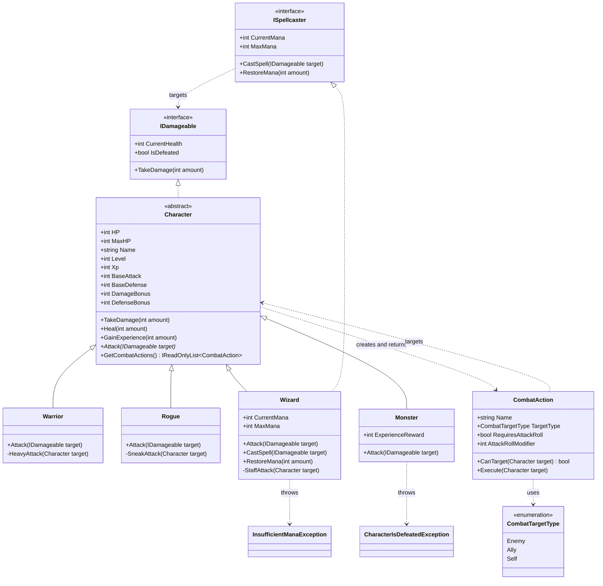

# Characters and Combat Actions

[Back to the readable UML guide](../UML-Overview.md) · [Everything diagram](../UML.md)

> **Canonical diagram:** [UML.md](../UML.md) is authoritative. This focused
> view is provided for readability and may occasionally lag behind it.

